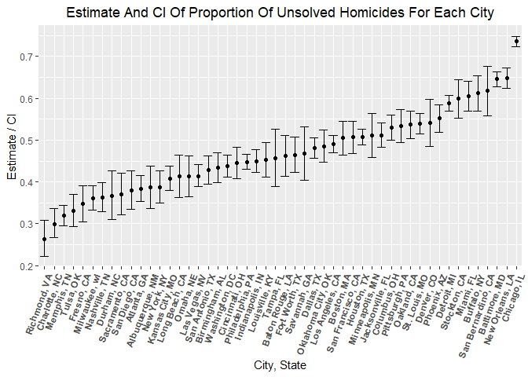

p8105_hw5_bf2506
================
bf2506
2022-11-15

``` r
library(tidyverse)
```

### Problem 2

``` r
homi_data = 
  read.csv("./data/homicide-data.csv") %>%
  janitor::clean_names()
```

**Describe the raw data:**

- The dataset has 12 variables and 52179 observations.

  - “uid”(the abbreviation of city - number); “reported_date”

  - “victim_last”(last name of victim); “victim_first”(first name of
    victim); “victim_race”; “victim_age”; “victim_sex”

  - “city”; “state”; “lat”(latitude); “lon”(longitude);

  - “disposition”:

    - Closed by arrest when *police reported that to be the case*
    - Closed without arrest when *police reported that to be
      “exceptionally cleared.”* Those are cases in which there is
      sufficient evidence but an arrest is not possible, for example, if
      the suspect has died.
    - Open/No arrest: *All other cases* were classified as having no
      arrest.

##### Part A

Create a city_state variable and then summarize within cities to obtain
the total number of homicides and the number of unsolved homicides.

``` r
homi_data = 
  homi_data %>% 
  mutate(city_state = paste(city, state, sep = ", ", collapse = NULL))

total_df = 
  homi_data %>% 
  group_by(city_state) %>% 
  summarize(total_number_homicide = n())

unsolved_df = 
  homi_data %>%
  filter(disposition != "Closed by arrest") %>% 
  group_by(city_state) %>% 
  summarize(number_unsolved_homicide = n())

total_unsolved_df = 
  left_join(total_df, unsolved_df) %>% 
  replace(is.na(.), 0)
```

*Tulsa, AL doesn’t have a unsolved homicide, so it is not included in
unsolved_df.*

##### Part B

For the city of Baltimore, MD, use the prop.test function to estimate
the proportion of homicides that are unsolved; save the output of
prop.test as an R object, apply the broom::tidy to this object and pull
the estimated proportion and confidence intervals from the resulting
tidy dataframe.

``` r
balt_prop = 
  prop.test(1825, 2827, p = NULL, 
            alternative = "two.sided", conf.level = 0.95, correct = TRUE)
balt_prop
```

    ## 
    ##  1-sample proportions test with continuity correction
    ## 
    ## data:  1825 out of 2827, null probability 0.5
    ## X-squared = 239.01, df = 1, p-value < 2.2e-16
    ## alternative hypothesis: true p is not equal to 0.5
    ## 95 percent confidence interval:
    ##  0.6275625 0.6631599
    ## sample estimates:
    ##         p 
    ## 0.6455607

``` r
balt_prop_tibble = broom::tidy(balt_prop)
balt_prop_tibble
```

    ## # A tibble: 1 × 8
    ##   estimate statistic  p.value parameter conf.low conf.high method        alter…¹
    ##      <dbl>     <dbl>    <dbl>     <int>    <dbl>     <dbl> <chr>         <chr>  
    ## 1    0.646      239. 6.46e-54         1    0.628     0.663 1-sample pro… two.si…
    ## # … with abbreviated variable name ¹​alternative

``` r
balt_prop_tibble %>% pull(estimate)
```

    ##         p 
    ## 0.6455607

``` r
balt_prop_tibble %>% pull(conf.low)
```

    ## [1] 0.6275625

``` r
balt_prop_tibble %>% pull(conf.high)
```

    ## [1] 0.6631599

``` r
balt_prop_tibble %>% mutate(ci = paste("(", round(conf.low, 4), ",", round(conf.high, 4), ")")) %>% pull(ci)
```

    ## [1] "( 0.6276 , 0.6632 )"

##### Part C

Run prop.test for every city. Extract *the proportion of unsolved
homicides* and *the confidence interval*. Do this within a “tidy”
pipeline, making use of purrr::map, purrr::map2, list columns and unnest
as necessary to create a tidy dataframe with estimated proportions and
CIs for each city.

``` r
prop_df = 
  total_unsolved_df %>% 
  mutate(result = purrr::map2(.x = number_unsolved_homicide, .y = total_number_homicide, ~broom::tidy(prop.test(x = .x, n = .y, alternative = "two.sided", conf.level = 0.95, correct = TRUE)))) %>% 
  unnest(result) %>% 
  select(city_state, estimate, conf.low, conf.high) %>% 
  mutate(confidence_interval = paste("(", round(conf.low, 4), ",", round(conf.high, 4), ")"))

prop_df
```

    ## # A tibble: 51 × 5
    ##    city_state      estimate conf.low conf.high confidence_interval
    ##    <chr>              <dbl>    <dbl>     <dbl> <chr>              
    ##  1 Albuquerque, NM    0.386    0.337     0.438 ( 0.3373 , 0.4376 )
    ##  2 Atlanta, GA        0.383    0.353     0.415 ( 0.3528 , 0.4148 )
    ##  3 Baltimore, MD      0.646    0.628     0.663 ( 0.6276 , 0.6632 )
    ##  4 Baton Rouge, LA    0.462    0.414     0.511 ( 0.4142 , 0.511 ) 
    ##  5 Birmingham, AL     0.434    0.399     0.469 ( 0.3992 , 0.469 ) 
    ##  6 Boston, MA         0.505    0.465     0.545 ( 0.4646 , 0.5451 )
    ##  7 Buffalo, NY        0.612    0.569     0.654 ( 0.5688 , 0.6541 )
    ##  8 Charlotte, NC      0.300    0.266     0.336 ( 0.2661 , 0.3359 )
    ##  9 Chicago, IL        0.736    0.724     0.747 ( 0.724 , 0.7474 ) 
    ## 10 Cincinnati, OH     0.445    0.408     0.483 ( 0.408 , 0.4831 ) 
    ## # … with 41 more rows

Considering the total number of homicides is 1 and the number of
unsolved homicides is 0 in Tulsa, AL, the data is too small and
insufficient in prop.test. We should pay attention to Tulsa, AL data.

##### Part C

Create a plot that shows the estimates and CIs for each city – check out
geom_errorbar for a way to add error bars based on the upper and lower
limits. Organize cities according to the proportion of unsolved
homicides

``` r
Estimates_CIs_Plot = 
  prop_df %>% 
  filter(city_state != "Tulsa, AL") %>% 
  ggplot(aes(x = reorder(city_state, estimate), y = estimate)) + 
  geom_point() +
  geom_errorbar(aes(ymin = conf.low, ymax = conf.high)) +
  theme(axis.text.x = element_text(angle = 45, hjust = 1)) +
  labs(title = "Estimate And CI Of Proportion Of Unsolved Homicides For Each City", x = "City, State", y = "Estimate / CI")

Estimates_CIs_Plot
```

<!-- -->
Since I discussed aboved, the total number of homicides and the number
of unsolved homicides in Tulsa, AL are not sufficient and enough to
analyze and run a prop.test, I drop this data when making the “Estimate
And CI Of Proportion Of Unsolved Homicides For Each City” plot.

### Problem 3
